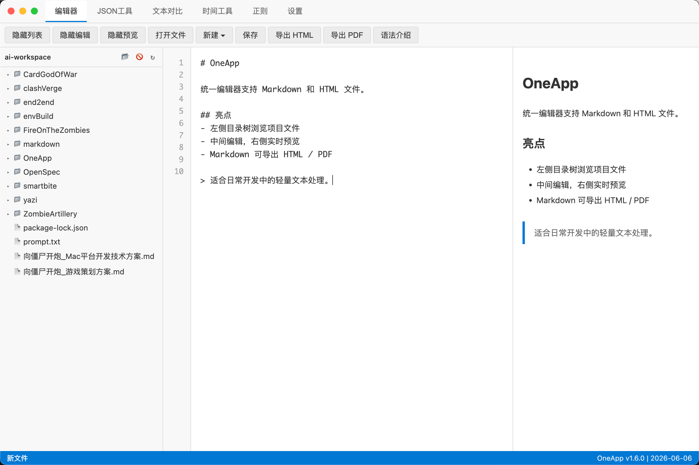
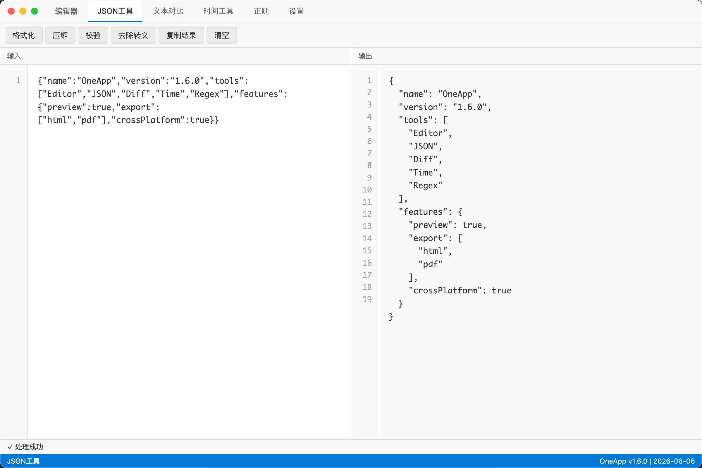
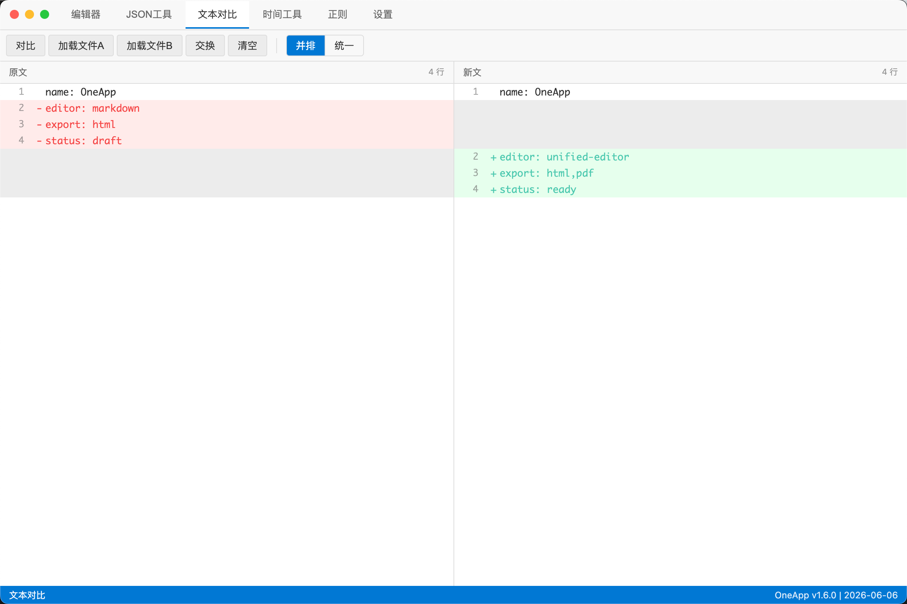
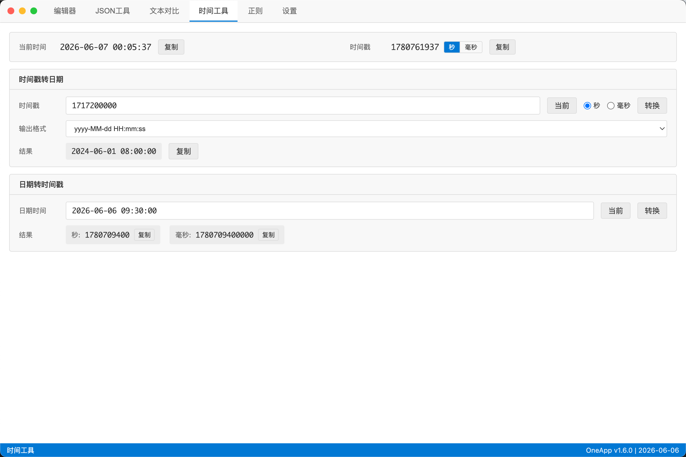
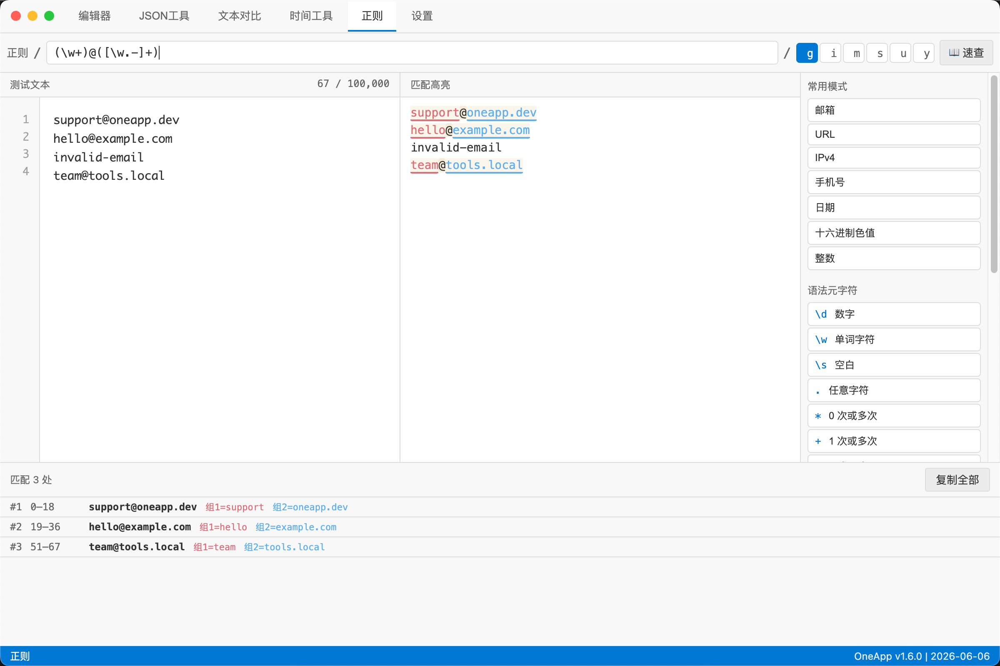

# OneApp

多功能开发工具桌面应用，集成统一编辑器（Markdown / HTML 自动识别）、数据工具（JSON / YAML / CSV / SQL / XML / JSONPath）、文本对比、文本处理、生成器、时间与 Cron、正则测试、编码工具合集、Agent 研讨室和应用级更新检查。

## 界面预览

| 统一编辑器 | 数据工具 |
|------------|-----------|
|  |  |

| 文本对比 | 时间工具 |
|----------|----------|
|  |  |

| 正则测试器 |
|------------|
|  |

## 功能特性

### 编辑器（Markdown / HTML）
- 按文件后缀自动识别类型：`.md` 使用 Markdown 预览（支持 GFM，双向滚动同步），`.html`/`.htm` 使用 iframe 沙箱实时预览（脚本/样式隔离）
- 文件管理：新建（Markdown / HTML 各有模板）、打开、保存、导出（Markdown → HTML / PDF）
- **目录树浏览**：侧边栏内像文件管理器一样浏览子目录、切换目录根、直接点开文件，按当前模式过滤显示对应类型
- **系统文件对话框**：可打开工作目录外的任意 `.md` / `.html` / `.htm` 文件
- 编辑器行号显示，可分别隐藏文件列表、编辑器或预览区

### 数据工具
- JSON 格式化（美化）
- JSON 压缩（最小化）
- JSON 验证（语法检查，定位错误行/列）
- JSON 反转义处理
- JSONPath 查询，展示匹配数量、结果路径和值摘要，并输出完整匹配结果 JSON
- JSON → YAML 转换，输出易读的 block-style YAML
- YAML → JSON 转换，输出格式化 JSON
- YAML 单文档校验，多文档输入会明确提示暂不支持
- CSV → JSON 转换，按表头输出对象数组
- JSON → CSV 转换，支持对象数组字段并集
- CSV 表格预览，只读展示二维表并支持横向滚动
- SQL 格式化与压缩
- XML 格式化、压缩与明显结构错误提示
- 语法高亮显示

### 文本对比
- 并排对比模式：左右对照显示差异
- 统一对比模式：类似 git diff 格式
- 差异统计：新增、删除、修改行数
- 支持水平/垂直滚动同步

### 文本处理
- 文本统计：字符数、字数、行数、非空行数、UTF-8 字节数
- 大小写与命名风格转换：大写、小写、首字母大写、camelCase、PascalCase、snake_case、kebab-case
- 按行排序：A-Z / Z-A
- 按行去重：保留首次出现顺序，并展示原始行数、保留行数和移除行数
- 纯前端离线处理，结果支持一键复制

### 生成器
- UUID v4：支持单个和批量生成，批量结果每行一个
- 随机密码：支持长度、大小写、数字、符号、排除易混字符
- Lorem 占位文本：支持按词、句、段生成
- 纯前端离线生成，结果支持一键复制

### 时间工具
- 实时显示当前时间和时间戳
- 时间戳转日期（支持秒/毫秒，多种输出格式）
- 日期转时间戳（同时输出秒和毫秒）
- Cron 表达式解释器：支持标准 5 位 Cron，展示可读解释和未来 5 次本地时间执行点
- 一键复制结果

### 正则测试器
- 结构化输入 `/ pattern / flags`，flags（g/i/m/s/u/y）可点击切换
- 实时匹配：编辑 pattern 或测试文本即时刷新结果
- 测试文本「编辑 / 高亮预览」分栏，匹配片段染色，多个捕获组用不同颜色
- 匹配结果列表（序号、位置、匹配值、各捕获组值），与预览高亮双向 hover 联动
- 右侧速查抽屉：常用模式（邮箱/URL/IP…点击填入）、语法元字符（点击插入光标处）、flags 说明
- 正则匹配在 Web Worker 中执行并设超时兜底，灾难性回溯也不会冻结界面

### 编码工具合集
左侧菜单切换 6 个子工具，纯前端离线、零数据外传：
- **Base64**：文本 ⇄ Base64，正确支持中文 / emoji（UTF-8）
- **URL**：文本 ⇄ URL 编码（`encodeURIComponent`）
- **JWT**：解码展示 Header / Payload / Signature 三段，`exp` / `iat` / `nbf` 附人类可读时间（不验签）
- **Hash**：一次性输出 MD5 / SHA-1 / SHA-256 / SHA-512（hex 小写）
- **进制**：Dec / Hex / Oct / Bin 四框联动，基于 BigInt 支持大整数
- **Unicode**：文本 ⇄ 转义，格式三选一（`\u` / `\u{}` / HTML 实体），正确处理 emoji

### Agent 研讨室
- 让多个本地 AI 编码 agent（V1 支持 **Codex** 与 **ClaudeCode**）在**只读**模式下独立审视所选本地仓库，再交叉评审、由主持 agent 汇总出实现方案
- 固定流程：第一轮独立提案 → 第二轮交叉评审（单 agent 时为自我评审，仅第一轮成功的 agent 进入第二轮）→ 主持 agent 最终汇总
- **只读安全多重保障**：以 Codex 内核级只读沙箱、ClaudeCode plan 模式 + 只读工具白名单为主防线；每阶段 `git status` 快照比对为咨询式二次防线，发现工作区变化仅提示、不中断
- **输出安全渲染**：Agent 输出经 DOMPurify 消毒后再展示，剥离脚本 / 事件属性 / `javascript:` 链接
- 自动检测 CLI 安装与登录态，仅「就绪」agent 可参与；研讨记录可恢复查看，左侧进度 chip 可快速定位对应消息，并可导出为 Markdown
- 开始前提示预计调用次数与首次成本（会真实调用本地 CLI、消耗对应服务用量）
- 平台：目前仅 **macOS / Linux** 可用，Windows 暂显示「暂不支持」

### 设置与更新
- 设置页展示当前版本、构建日期、最近文件、主题和快捷键说明
- 「检查更新」会请求 GitHub Releases 最新正式版本，比较当前版本，并在有新版时展示版本号、发布日期和更新说明摘要
- 应用级提示统一使用带 OneApp 图标的系统消息框，图标不可用时自动降级为系统默认样式

## 系统要求

| 操作系统 | 状态 | 版本要求 |
|----------|------|----------|
| **macOS** | ✅ 已支持 | 10.15+ (Intel/Apple Silicon) |
| **Windows** | ✅ 已支持 | 10+ (64 位) |
| **Linux** | ✅ 已支持 | Ubuntu 20.04+ / Debian 10+ |

> 💡 自 **v1.4.0** 起，每次发布由 CI 自动构建三平台安装包并上传到 [GitHub Releases](https://github.com/kaituoC/OneApp/releases)。（v1.3.0 及更早仅提供 macOS 包。）

---

## 安装与运行

前往 [GitHub Releases](https://github.com/kaituoC/OneApp/releases) 下载最新版本对应平台的安装包。产物命名格式为 `OneApp-<版本>-<平台>-<架构>.<扩展名>`。

### 🍎 macOS

- Apple Silicon：`OneApp-<版本>-mac-arm64.dmg`（或 `-mac-arm64.zip`）
- Intel：`OneApp-<版本>-mac-x64.dmg`（或 `-mac-x64.zip`）

打开 DMG，拖拽 OneApp 到 Applications。应用未签名，首次打开请**右键 →「打开」**，或在「系统设置 → 隐私与安全性」中点「仍要打开」。

### 🪟 Windows

- `OneApp-<版本>-win-x64.exe` — NSIS 安装包（推荐，可选安装路径、创建快捷方式）
- `OneApp-<版本>-win-x64.zip` — 便携版（解压即用）

### 🐧 Linux

- `OneApp-<版本>-linux-x86_64.AppImage` — 通用格式，免安装单文件
- `OneApp-<版本>-linux-amd64.deb` — Debian / Ubuntu 系统安装

**AppImage 运行：**

```bash
# 加可执行权限后直接运行（或右键 → 属性 → 勾选「允许作为程序执行」）
chmod +x OneApp-<版本>-linux-x86_64.AppImage
./OneApp-<版本>-linux-x86_64.AppImage
```

> ⚠️ **FUSE 提示**：部分发行版（如 Ubuntu 22.04+）默认缺少旧版 FUSE，运行时可能报 `dlopen(): error loading libfuse.so.2`。二选一解决：
> - 安装 FUSE：`sudo apt install libfuse2`
> - 或免 FUSE 解压运行：`./OneApp-<版本>-linux-x86_64.AppImage --appimage-extract-and-run`

**deb 安装：** `sudo apt install ./OneApp-<版本>-linux-amd64.deb`（或 `sudo dpkg -i OneApp-<版本>-linux-amd64.deb`）

---

### 🔧 从源码构建（所有平台）

需 Node.js 20+（推荐 20 LTS）与 Git：

```bash
git clone https://github.com/kaituoC/OneApp.git
cd OneApp
npm install            # 国内用户可用 ./install.sh（已配镜像）
npm run dist:mac       # 或 dist:win / dist:linux，产物输出到 dist/
```

---

### 快速安装（推荐）

国内用户建议使用自动化安装脚本，已配置淘宝镜像和 Electron 国内镜像：

```bash
# 赋予执行权限
chmod +x install.sh

# 一键安装依赖
./install.sh
```

脚本功能：
- 🧹 自动清理旧的 `node_modules` 和 `package-lock.json`
- ⚙️ 自动配置 npm 淘宝镜像
- 📦 自动配置 Electron 国内镜像
- 🔄 安装失败自动重试（最多 3 次）
- ✅ 安装完成后验证关键依赖

### 手动安装

```bash
# 安装依赖
npm install

# 或手动指定镜像源
npm install --registry=https://registry.npmmirror.com
```

### 开发模式

```bash
# 本地开发模式
npm run dev

# 构建生产版本
npm run build

# 预览生产版本
npm run preview

# 打包分发（三平台 target；单平台用 dist:mac / dist:win / dist:linux）
npm run dist
```

## 快捷键

| 快捷键 | 功能 |
|--------|------|
| Ctrl/Cmd + N | 新建文件 |
| Ctrl/Cmd + O | 打开文件 |
| Ctrl/Cmd + S | 保存文件 |
| Ctrl/Cmd + W | 关闭当前文件 |
| Ctrl/Cmd + R / F5 | 刷新页面 |
| Ctrl/Cmd + Tab | 切换下一个标签 |
| Ctrl/Cmd + Shift + Tab | 切换上一个标签 |
| Ctrl/Cmd + 1~9 / 0 | 切换到指定标签 |
| F12 | 打开/关闭调试工具 |

## 技术栈

- Electron 28
- Vue 3 (Composition API)
- electron-vite 构建工具
- marked (Markdown 解析)
- yaml (YAML 解析与序列化)
- papaparse (CSV 解析与序列化)
- sql-formatter (SQL 格式化)
- fast-xml-parser (XML 验证/解析)
- diff-match-patch (文本对比)
- CodeMirror 6 (JSON 编辑器)
- js-md5 (MD5 计算，SHA 系列走原生 Web Crypto)
- electron-store (配置持久化)

## 项目结构

```
OneApp/
├── electron/
│   ├── main.js          # 主进程入口
│   └── assets/          # 应用图标
├── preload.cjs          # 预加载脚本（IPC 桥接）
├── src/renderer/
│   ├── App.vue          # 根组件
│   ├── components/      # UI 组件
│   ├── utils/           # 工具函数
│   └── styles/          # 全局样式
├── electron.vite.config.js  # 构建配置
└── package.json         # 项目配置
```

## 许可证

MIT License
